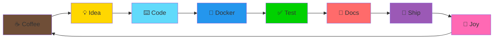

<div align="center">

  

  

  <p>
    <a href="https://github.com/Enthusiast-AD"></a>
    
    
    
  </p>
</div>


<p align="center">
  
</p>

<h2 align="center" style="font-family: 'Fira Code', monospace;">
  
  Speedrun ⚡
</h2>

```ascii
╔════════════════════════════════════════════════════════════════╗
║  👋  Hi! I'm a student dev who likes shipping > sleeping      ║
║  🧰  Build: Dockerized → Typed → Tested → Documented → Ship  ║
║  🎯  Mission: Fast apps + Clean code + Happy users = 💯       ║
║  ☕ + ♟️ + 🎧 = productive mode (Combo: 🔥 x5)                ║
║  🧠  Current: Orbina (blog) • Cosmic Chatbot (agentic AI)    ║
╚════════════════════════════════════════════════════════════════╝
```

<details>
<summary><b>📊 Status Board (Click to expand)</b></summary>
<br>

- [x] ☕ Coffee acquired
- [x] 🤖 Agents aligned
- [x] ✅ Tests behaving (for now)
- [x] 🐳 Containers running smooth
- [x] 📝 Docs up to date
- [ ] 🌱 Touch grass
- [ ] 😴 Sleep (optional)

</details>


<p align="center">
  
</p>

<h2 align="center">
  
  Toolbelt
</h2>

<p align="center">
  
</p>

<table align="center">
  <tr>
    <td align="center" width="33%">
      <h3>🎨 Frontend</h3>
      
      
      
      
    </td>
    <td align="center" width="33%">
      <h3>⚙️ Backend</h3>
      
      
      
      
    </td>
    <td align="center" width="33%">
      <h3>🤖 AI & Tools</h3>
      
      
      
      
    </td>
  </tr>
</table>

<p align="center">
  <b style="font-size: 18px;">🧠 AI Sidekicks:</b>
  <br>
  
  
  
  
</p>

<details>
<summary><b>💻 Code Sample (Click to expand)</b></summary>

```py
# speedrun.py
from fastapi import FastAPI
from typing import Literal

coffee: Literal["hot", "refill"] = "hot"
mood = "shipping 🚀" if coffee else "refactoring (still shipping) 🚢"

app = FastAPI(
    title="Cosmic-Chatbot",
    description="Chat across the cosmos ✨",
    version="2.0.0"
)

@app.get("/health")
def health():
    return {
        "status": "ok",
        "mood": mood,
        "elo": "♟️ +100 after deploy 🤞",
        "coffee_level": "optimal ☕"
    }

@app.get("/deploy")
def deploy():
    return {"message": "Ship it! 🚀", "containers": "🐳 ready"}
```

</details>


<p align="center">
  
</p>

<h2 align="center">🌟 Featured Builds</h2>

<div align="center">

<table>
<tr>
<td width="50%">
<h3 align="center">Orbina 🌌</h3>
<p align="center">
  <a href="https://github.com/enthusiast-ad/orbina" target="_blank">
    
  </a>
  <a href="https://orbina.net" target="_blank">
    
  </a>
</p>
<p align="center">
  
  
  
</p>
<p><i>"Where ideas orbit and words land."</i></p>
<p>⚡ Blazing-fast blog site with markdown support, SEO optimization, and a sleek UI that makes reading a joy.</p>
</td>

<td width="50%">
<h3 align="center">Cosmic Chatbot 🤖</h3>
<p align="center">
  <a href="https://github.com/enthusiast-ad/chatbot" target="_blank">
    
  </a>
  <a href="https://chatbot-gules-theta.vercel.app" target="_blank">
    
  </a>
</p>
<p align="center">
  
  
  
</p>
<p><i>"Chat across the cosmos."</i></p>
<p>🧠 Agentic AI assistant with memory, tool use, and multi-turn conversations. Built with LangGraph for complex workflows.</p>
</td>
</tr>
</table>

</div>

<details>
<summary><b>📜 Deploy Log (Click to expand)</b></summary>

```txt
deploy.log
━━━━━━━━━━━━━━━━━━━━━━━━━━━━━━━━━━━━━━━━━━━━━
[✓] Built Docker images
[✓] Migrations danced gracefully
[✓] Agents aligned their tools
[✓] Blog posts launched into orbit
[✓] Tests passed (even the flaky ones!)
[✓] CI/CD pipeline: GREEN 🟢
[!] If something fails, blame the 🐛 not the barista
━━━━━━━━━━━━━━━━━━━━━━━━━━━━━━━━━━━━━━━━━━━━━
Status: SHIPPED 🚀
Coffee consumed: 3 cups ☕☕☕
Time to production: 2 hours
Bugs found in prod: 0 (so far... 🤞)
━━━━━━━━━━━━━━━━━━━━━━━━━━━━━━━━━━━━━━━━━━━━━
```

</details>


<p align="center">
  
</p>

<h2 align="center">🎮 Fun Bits</h2>

<table align="center">
<tr>
<td align="center">♟️<br><b>Castle Early</b><br><sub>Refactor early. Same energy.</sub></td>
<td align="center">🐳<br><b>Containers Travel</b><br><sub>Better than my coffee mug</sub></td>
<td align="center">⏰<br><b>Time Unit</b><br><sub>"One more commit"</sub></td>
<td align="center">✅<br><b>Love Language</b><br><sub>Passing tests</sub></td>
</tr>
</table>

<details>
<summary><b>🎭 Vibe Check (Click to run)</b></summary>

```js
// vibe-check.js
const vibe = ["☕", "♟️", "🎧", "🧠", "🚀"];
const multiplier = Math.floor(Math.random() * 10) + 1;

console.log(`Dev vibe today: ${vibe.join(" + ")} = GG 🏆`);
console.log(`Productivity multiplier: 🔥 x${multiplier}`);
console.log(`Status: ${multiplier > 5 ? "CRUSHING IT 💪" : "VIBING 😎"}`);

// Output:
// Dev vibe today: ☕ + ♟️ + 🎧 + 🧠 + 🚀 = GG 🏆
// Productivity multiplier: 🔥 x7
// Status: CRUSHING IT 💪
```

</details>


<p align="center">
  
</p>

<h2 align="center">🛠️ What I Build</h2>



<table align="center">
<tr>
<td>

**Full-Stack Development**
- ⚡ FastAPI backends with async/await
- ⚛️ React frontends with hooks & state
- 🎨 Tailwind CSS for pixel-perfect UI

</td>
<td>

**AI & Agents**
- 🦜 LangChain for LLM orchestration
- 🕸️ LangGraph for agent workflows
- 🧠 RAG, memory, tool use

</td>
</tr>
<tr>
<td>

**DevOps & Containers**
- 🐳 Docker & docker-compose
- 🔄 CI/CD pipelines
- 📊 Monitoring & logging

</td>
<td>

**Clean Code**
- 📘 Type hints & type checking
- ✅ Unit & integration tests
- 📚 Docs that match behavior

</td>
</tr>
</table>

<details>
<summary><b>🎯 Commit Philosophy (Click to expand)</b></summary>

```bash
$ git commit -m "feat: teach agent to make coffee ☕"
[main 7f3a5c2] feat: teach agent to make coffee ☕
 3 files changed, 42 insertions(+), 0 deletions(-)
 create mode 100644 coffee_agent.py

$ git push origin main
Enumerating objects: 5, done.
Counting objects: 100% (5/5), done.
Delta compression using up to 8 threads
Compressing objects: 100% (3/3), done.
Writing objects: 100% (3/3), 1.23 KiB | 1.23 MiB/s, done.
Total 3 (delta 2), reused 0 (delta 0), pack-reused 0

# CI Pipeline Response:
# ✅ Build: PASSED
# ✅ Tests: PASSED
# ✅ Deploy: SUCCESS
# 💬 Comment: "Approved, but make one for me too ☕"
```

</details>


<h2 align="center">📊 GitHub Stats & Activity</h2>

<div align="center">
  
  
  

</div>

<div align="center">
  
  

</div>

<div align="center">
  
  

</div>

<div align="center">
  
  

</div>

<details align="center">
<summary><b>📈 Contribution Graph (Click to expand)</b></summary>
<br>


</details>


<div align="center">
  
  ### 🔥 Commit Heatmap
  
  
  
  <sub><i>My contribution heatmap - darker = more commits! 🔥</i></sub>
  
</div>


<p align="center">
  
</p>

<h2 align="center">🤝 Let's Connect</h2>

<p align="center">
  <a href="https://github.com/Enthusiast-AD">
    
  </a>
  <a href="mailto:anshdeep00.dev@gmail.com">
    
  </a>
</p>

<p align="center">
  
  
  
</p>

<details align="center">
<summary><b>💬 Want to collaborate? (Click for ideas)</b></summary>
<br>

| Type | What | Why |
|------|------|-----|
| 🤖 | AI Agent Projects | Love building smart assistants |
| 📝 | Blog Platforms | Make writing & reading beautiful |
| ♟️ | Chess Apps | Always down for chess tech |
| 🎨 | UI/UX | Clean design = happy users |
| 🧪 | Open Source | Sharing is caring |

**Let's build something awesome together!** Drop me a message. 📬

</details>


<div align="center">
  
  ### 💭 Random Dev Quote
  
  
  
  ### 😂 Dev Meme of the Day
  
  
  
</div>


<div align="center">
  
  <h3>🎯 2025 Goals</h3>
  
  <table>
  <tr>
  <td>🚀 Ship 5 major projects</td>
  <td>✅ Contribute to 10+ open source repos</td>
  </tr>
  <tr>
  <td>🧠 Master LangGraph & agent architectures</td>
  <td>📚 Write 24 technical blog posts</td>
  </tr>
  <tr>
  <td>♟️ Reach 2000 ELO in chess</td>
  <td>☕ Try 52 different coffee beans</td>
  </tr>
  </table>
  
</div>


<div align="center">
  
  
  
  <h3>
    
    Thanks for visiting!
    
  </h3>
  
  <p>
    <i>"Move fast, ship clean, and let the agents do the boring bits."</i>
  </p>
  
  <p>
    
  </p>
  
  <sub>⭐ Star some repos if you like what you see! ⭐</sub>
  
</div>
